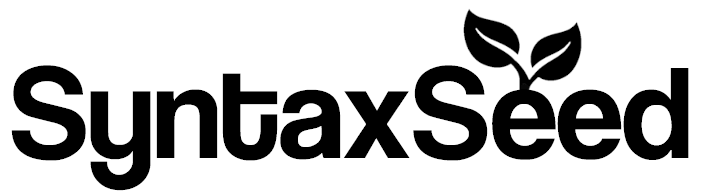
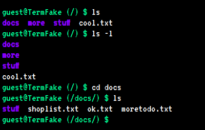
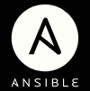
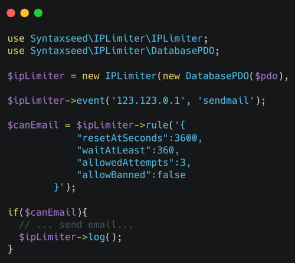
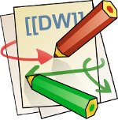
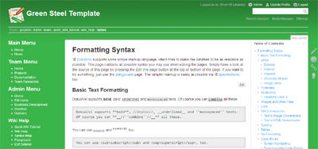
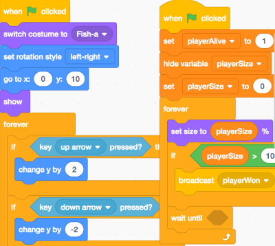

# 

## About SyntaxSeed

Free and Open Source code, plugins, applications and themes by Canadian web developer Sherri Wheeler (she/her). My way of giving back to the OSS and developer community.

## Find Me

* [Blog](https://blog.syntaxseed.com)
* [Twitter](https://twitter.com/SyntaxSeed)
* [Dev.to](https://dev.to/syntaxseed)
* [My Company: Avinus](https://www.avinus.com/)

## Featured Projects

I create plugins for other OSS projects, libraries and packages for PHP projects (installable via Composer), snippets, themes and more. See my list of **pinned** projects below or [browse my repositories](https://github.com/syntaxseed?tab=repositories).

|               |               |
| ------------- |:-------------:|
|  | [Terminal Faker](https://github.com/syntaxseed/terminalfaker) |
|  | [PHP PlayBall](https://github.com/syntaxseed/playball) |
|  | [IP Limiter](https://github.com/syntaxseed/iplimiter) |
|  | [DokuWiki Plugin: DokuCrypt2](https://github.com/syntaxseed/dokucrypt2) |
|  | [DokuWiki Theme: GreenSteel](https://github.com/syntaxseed/greensteel-template) |
|  | [Coding Resources For Kids](https://github.com/syntaxseed/codingforkids) |

## Donate/Contribute

> Pull requests are welcome for my OSS projects. Please reach out and ask first about what you would like to contribute.

### Want To Buy Me A Coffee?

Thank you for your interest in contributing to my open source and free code resources and applications. I use **PayPal** and **GitHub Sponsors**. Your contribution helps to pay for hosting, development tools, and to help maintain these projects and more in the future.

**PayPal:**
<form action="https://www.paypal.com/cgi-bin/webscr" method="post">
<input type="hidden" name="cmd" value="_s-xclick">
<input type="hidden" name="encrypted" value="-----BEGIN PKCS7-----MIIHRwYJKoZIhvcNAQcEoIIHODCCBzQCAQExggEwMIIBLAIBADCBlDCBjjELMAkGA1UEBhMCVVMxCzAJBgNVBAgTAkNBMRYwFAYDVQQHEw1Nb3VudGFpbiBWaWV3MRQwEgYDVQQKEwtQYXlQYWwgSW5jLjETMBEGA1UECxQKbGl2ZV9jZXJ0czERMA8GA1UEAxQIbGl2ZV9hcGkxHDAaBgkqhkiG9w0BCQEWDXJlQHBheXBhbC5jb20CAQAwDQYJKoZIhvcNAQEBBQAEgYC8szLDUNJbvhiluEQA9F7VbyFymTQ4gg8/HcXhIMSMeDCI6sbpqilS5ie9GwaoxTJHBdAdw44owFezWNEL/DBB4zekNsoj1zgZdQ2js51y1HdFQ56r16RF3hWpM2CBzMRE3iKQaUN7RwenpH182omKh0g2Y0YHa2/x2078t4AP3TELMAkGBSsOAwIaBQAwgcQGCSqGSIb3DQEHATAUBggqhkiG9w0DBwQI5HprhPIudJaAgaCNQs/sVP2LxS2JxLiHoG9SzgjgBB2oAINfBkE3tWFI9v6FXCj4+nZiVGqy20InXgSpqKfVPIO2T/lioOWWmLFAiBvKfabTLqNdSqH5MoHtsaxD5gP4anVQ2Sk71qayHuV+oi70dLF35g3MEBNrkwFPuJSuecl/QV+Ood8uiYmUYhnISeaeTcoUvyUPy1Cx+YvySf29W1vIQlbqvxg+lxuvoIIDhzCCA4MwggLsoAMCAQICAQAwDQYJKoZIhvcNAQEFBQAwgY4xCzAJBgNVBAYTAlVTMQswCQYDVQQIEwJDQTEWMBQGA1UEBxMNTW91bnRhaW4gVmlldzEUMBIGA1UEChMLUGF5UGFsIEluYy4xEzARBgNVBAsUCmxpdmVfY2VydHMxETAPBgNVBAMUCGxpdmVfYXBpMRwwGgYJKoZIhvcNAQkBFg1yZUBwYXlwYWwuY29tMB4XDTA0MDIxMzEwMTMxNVoXDTM1MDIxMzEwMTMxNVowgY4xCzAJBgNVBAYTAlVTMQswCQYDVQQIEwJDQTEWMBQGA1UEBxMNTW91bnRhaW4gVmlldzEUMBIGA1UEChMLUGF5UGFsIEluYy4xEzARBgNVBAsUCmxpdmVfY2VydHMxETAPBgNVBAMUCGxpdmVfYXBpMRwwGgYJKoZIhvcNAQkBFg1yZUBwYXlwYWwuY29tMIGfMA0GCSqGSIb3DQEBAQUAA4GNADCBiQKBgQDBR07d/ETMS1ycjtkpkvjXZe9k+6CieLuLsPumsJ7QC1odNz3sJiCbs2wC0nLE0uLGaEtXynIgRqIddYCHx88pb5HTXv4SZeuv0Rqq4+axW9PLAAATU8w04qqjaSXgbGLP3NmohqM6bV9kZZwZLR/klDaQGo1u9uDb9lr4Yn+rBQIDAQABo4HuMIHrMB0GA1UdDgQWBBSWn3y7xm8XvVk/UtcKG+wQ1mSUazCBuwYDVR0jBIGzMIGwgBSWn3y7xm8XvVk/UtcKG+wQ1mSUa6GBlKSBkTCBjjELMAkGA1UEBhMCVVMxCzAJBgNVBAgTAkNBMRYwFAYDVQQHEw1Nb3VudGFpbiBWaWV3MRQwEgYDVQQKEwtQYXlQYWwgSW5jLjETMBEGA1UECxQKbGl2ZV9jZXJ0czERMA8GA1UEAxQIbGl2ZV9hcGkxHDAaBgkqhkiG9w0BCQEWDXJlQHBheXBhbC5jb22CAQAwDAYDVR0TBAUwAwEB/zANBgkqhkiG9w0BAQUFAAOBgQCBXzpWmoBa5e9fo6ujionW1hUhPkOBakTr3YCDjbYfvJEiv/2P+IobhOGJr85+XHhN0v4gUkEDI8r2/rNk1m0GA8HKddvTjyGw/XqXa+LSTlDYkqI8OwR8GEYj4efEtcRpRYBxV8KxAW93YDWzFGvruKnnLbDAF6VR5w/cCMn5hzGCAZowggGWAgEBMIGUMIGOMQswCQYDVQQGEwJVUzELMAkGA1UECBMCQ0ExFjAUBgNVBAcTDU1vdW50YWluIFZpZXcxFDASBgNVBAoTC1BheVBhbCBJbmMuMRMwEQYDVQQLFApsaXZlX2NlcnRzMREwDwYDVQQDFAhsaXZlX2FwaTEcMBoGCSqGSIb3DQEJARYNcmVAcGF5cGFsLmNvbQIBADAJBgUrDgMCGgUAoF0wGAYJKoZIhvcNAQkDMQsGCSqGSIb3DQEHATAcBgkqhkiG9w0BCQUxDxcNMTAxMTIzMjEyNzA1WjAjBgkqhkiG9w0BCQQxFgQUWz8HsBeDEyhPkOpwMAm34Xw2BcowDQYJKoZIhvcNAQEBBQAEgYCx7k+KAndOqVgGva1nz+PckuoyTGUzJerYLJjFPML2X32g8uoHejoKZ00nkqwzyEwVZQD3fvOop61uNcB+UgzkVJPi4CTyrdxJoAsbumyGcezqQIdbDxGCQzi3mMdfisvpd+pJTiIONblIGgx7a/Sw0draDbkVV/ZdJfnYXrMZCg==-----END PKCS7-----
">
<input type="image" src="https://www.paypal.com/en_US/i/btn/btn_donate_LG.gif" border="0" name="submit" alt="PayPal - The safer, easier way to pay online!">

</form>

**GitHub:**

Please contact me for other contribution methods.

Thank you!
