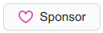

# 

## About SyntaxSeed

Free and Open Source code, plugins, applications and themes by Canadian web developer Sherri Wheeler (she/her). My way of giving back to the OSS and developer community.

## Find Me

* [Blog](https://blog.syntaxseed.com)
* [Mastodon](https://phpc.social/@syntaxseed)* 
* [Dev.to](https://dev.to/syntaxseed)
* [My Company: Avinus](https://www.avinus.com/)
* [Twitter](https://twitter.com/SyntaxSeed)

## Featured Projects

I create plugins for other OSS projects, libraries and packages for PHP projects (installable via Composer), snippets, themes and more. See my list of **pinned** projects below or [browse my repositories](https://github.com/syntaxseed?tab=repositories).

|               |               |
| ------------- |:-------------:|
|  | [Terminal Faker](https://github.com/syntaxseed/terminalfaker) |
|  | [PHP PlayBall](https://github.com/syntaxseed/playball) |
|  | [IP Limiter](https://github.com/syntaxseed/iplimiter) |
|  | [DokuWiki Plugin: DokuCrypt2](https://github.com/syntaxseed/dokucrypt2) |
|  | [DokuWiki Theme: GreenSteel](https://github.com/syntaxseed/greensteel-template) |
|  | [Coding Resources For Kids](https://github.com/syntaxseed/codingforkids) |

## Donate/Contribute

> Pull requests are welcome for my OSS projects. Please reach out and ask first about what you would like to contribute.

### Want To Buy Me A Coffee?

Thank you for your interest in contributing to my open source and free code resources and applications. I use **PayPal** and **GitHub Sponsors**. Your contribution helps to pay for hosting, development tools, and to help maintain these projects and more in the future.

**PayPal:**

**GitHub:**

Please contact me for other contribution methods.

Thank you!
